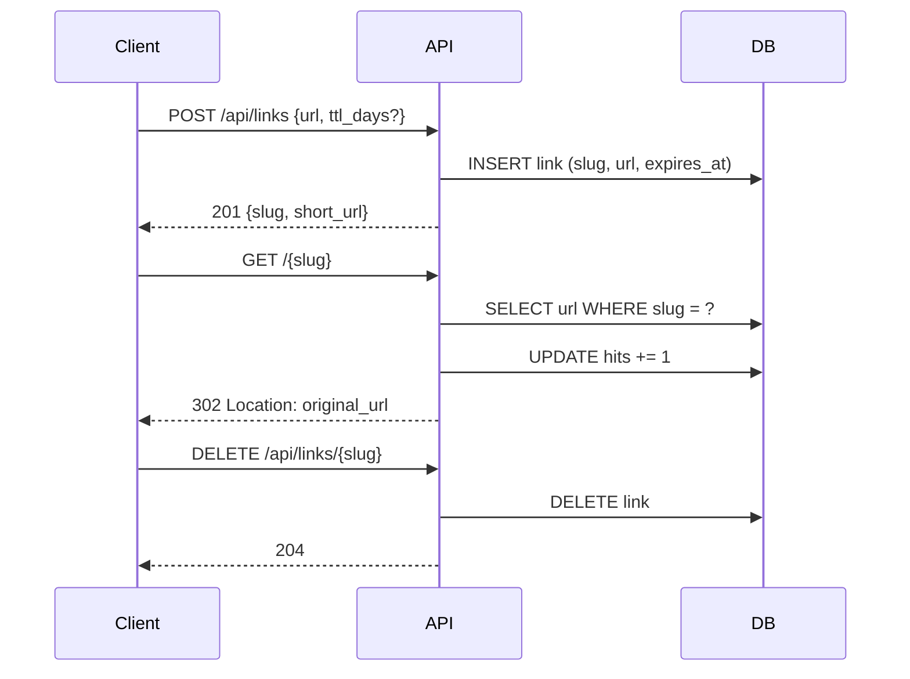
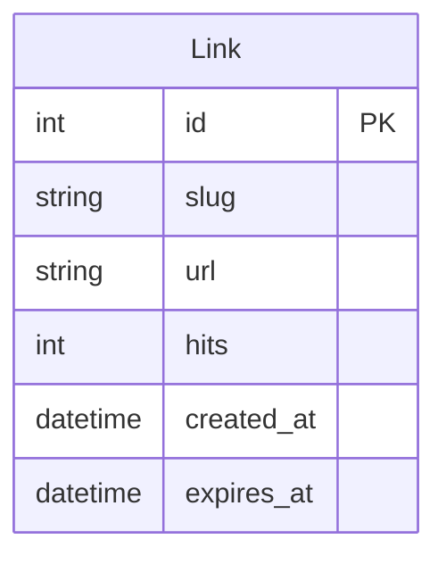

# ТЗ: URL Shortener API

> Простой сервис сокращения ссылок. Пользователь отправляет длинный URL, получает короткий slug.
> Анонимно, без регистрации. Ссылки живут 30 дней.

---

## 1. Мета

- Версия: 1.0
- Приоритет: high
- Статус: draft
- Дата: 2026-06-11

---

## 2. Цель

- Пользователь вставляет длинную ссылку → получает короткую вида `s.ht/abc123`
- При переходе по короткой ссылке → редирект на оригинальный URL
- Ссылки автоматически удаляются через 30 дней
- Никакой регистрации, никакого фронтенда — только API

---

## 3. Архитектура

### 3.1 Стек

- **Backend:** Python 3.13 + FastAPI
- **Database:** SQLite (через SQLAlchemy + Alembic)
- **Тесты:** pytest + httpx (AsyncClient)
- **Линтер:** ruff
- **Деплой:** локально через uvicorn

### 3.2 Паттерны

- **Router → Service → Repository** —三层ка
- **Ошибки:** кастомные HTTP-исключения (404, 409, 422, 410)
- **ID:** nanoid (8 символов, без коллизий)

### 3.3 Компоненты

| Компонент | Ответственность | Связи |
|-----------|----------------|-------|
| `links` | Создание, чтение, удаление ссылок | Link model |
| `stats` | Счётчик переходов | Link model |

### 3.4 Data Flow



---

## 4. Scope / Out of Scope

**In scope:**
- Создание короткой ссылки (POST /api/links)
- Редирект по slug (GET /{slug})
- Удаление ссылки (DELETE /api/links/{slug})
- Счётчик переходов (hits)
- TTL с авто-очисткой просроченных
- Консольный health-check endpoint

**Out of scope:**
- Авторизация / API-ключи
- Кастомные slugs (пользовательские алиасы)
- Статистика по дням/браузерам
- Фронтенд (SPA, админка)
- Rate limiting
- Docker-образ

---

## 5. Функциональные требования

| ID | Заголовок | Описание | Приоритет | Зависимости |
|----|-----------|----------|-----------|-------------|
| F-001 | Создать короткую ссылку | POST /api/links — принять url, вернуть slug + short_url | must | — |
| F-002 | Редирект по slug | GET /{slug} — 302 на оригинальный URL | must | F-001 |
| F-003 | Удалить ссылку | DELETE /api/links/{slug} — удалить по slug | must | F-001 |
| F-004 | TTL + авто-очистка | Просроченные ссылки -> 410 Gone, фоновое удаление | should | F-002 |

---

## 6. Data Models

```yaml
Link:
  id: integer PK autoincrement
  slug: string(12) unique indexed NOT NULL
  url: string(2048) NOT NULL
  hits: integer default 0
  created_at: timestamp default now
  expires_at: timestamp NOT NULL
```



---

## 7. API Contracts

### POST /api/links — создать ссылку

```
POST /api/links
Content-Type: application/json

Request:
{
  "url": "https://example.com/very/long/path?with=params",
  "ttl_days": 30
}

Response 201:
{
  "slug": "abc12345",
  "short_url": "http://localhost:8000/abc12345",
  "url": "https://example.com/very/long/path?with=params",
  "expires_at": "2026-07-11T00:00:00Z"
}

Response 422:
{
  "detail": [
    { "loc": ["body", "url"], "msg": "invalid or missing URL", "type": "value_error" }
  ]
}
```

### GET /{slug} — редирект

```
GET /abc12345

Response 302:
Location: https://example.com/very/long/path?with=params

Response 404:
{
  "detail": "Link not found"
}

Response 410:
{
  "detail": "Link expired"
}
```

### DELETE /api/links/{slug} — удалить

```
DELETE /api/links/abc12345

Response 204: (no body)

Response 404:
{
  "detail": "Link not found"
}
```

### GET /health — health check

```
GET /health

Response 200:
{
  "status": "ok"
}
```

---

## 8. UI / UX

API-only, UI нет. Всё взаимодействие через curl / HTTP-клиенты.

---

## 9. Acceptance Criteria

### F-001: Создать короткую ссылку
- [ ] AC-1: POST /api/links с валидным url → 201, slug 8 символов, short_url содержит slug
- [ ] AC-2: POST /api/links с пустым url → 422
- [ ] AC-3: POST /api/links с невалидным url (не url) → 422
- [ ] AC-4: POST /api/links с опциональным ttl_days=7 → expires_at = now+7d
- [ ] AC-5: POST /api/links без ttl_days → expires_at = now+30d (дефолт)

### F-002: Редирект по slug
- [ ] AC-1: GET /{slug} для существующей ссылки → 302, Location = оригинальный url
- [ ] AC-2: GET /{slug} для несуществующего slug → 404
- [ ] AC-3: GET /{slug} для просроченной ссылки → 410
- [ ] AC-4: После редиректа `hits` увеличился на 1

### F-003: Удалить ссылку
- [ ] AC-1: DELETE /api/links/{slug} для существующей → 204
- [ ] AC-2: DELETE /api/links/{slug} для несуществующей → 404
- [ ] AC-3: После удаления GET /{slug} → 404

### F-004: TTL + авто-очистка
- [ ] AC-1: Просроченная ссылка → 410 Gone
- [ ] AC-2: При старте приложения удаляются просроченные записи

---

## 10. Non-functional Requirements

- **Performance:** ответ API < 200ms (99-й перцентиль)
- **Security:** валидация URL (только http/https схемы, не IP, не localhost)
- **Storage:** SQLite, без миграций в первой версии (create_tables при старте)

---

## 11. Dependencies

| Зависимость | Версия | Для чего | Альтернативы |
|-------------|--------|----------|--------------|
| fastapi | 0.115+ | Web-фреймворк | Flask, Starlette |
| uvicorn | 0.30+ | ASGI-сервер | — |
| sqlalchemy | 2.0+ | ORM | — |
| httpx | 0.28+ | Тестовый клиент | requests |
| pytest | 8+ | Тест-раннер | — |
| ruff | 0.5+ | Линтер | flake8 |

---

## 12. Open Questions

_Заполняется аналитиком после первого прохода._

- [ ] Нужен ли rate limiting?
- [ ] Хранить ли slug коллизии или ретраить генерацию?
