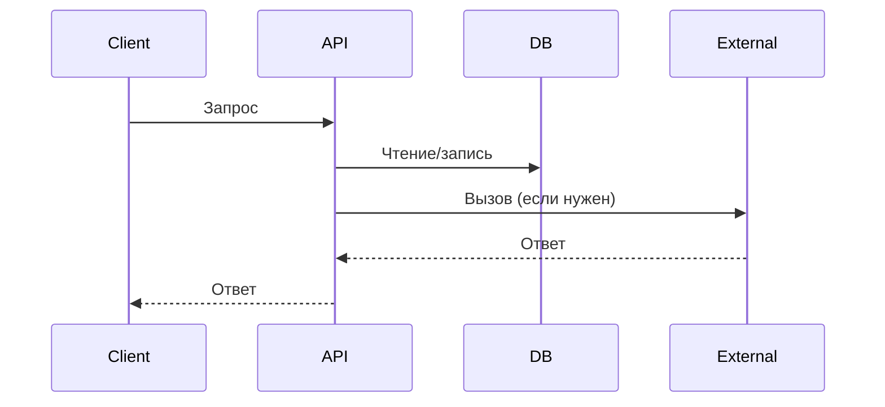
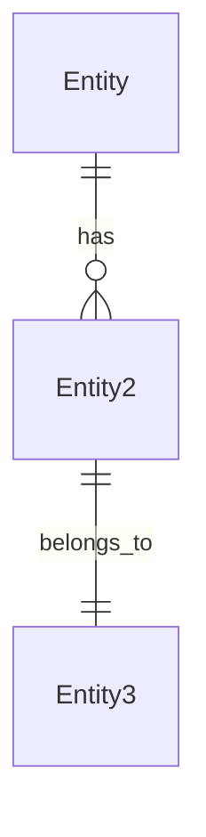

# ТЗ: [Название проекта/фичи]

> [Краткое описание: одна-две строки о том, что это за проект. Кто пользователь, в чём суть.]

---

## 1. Мета

- Версия: 1.0
- Приоритет: high | medium | low
- Статус: draft | review | approved
- Дата: [YYYY-MM-DD]

---

## 2. Цель

[Что делаем, зачем, для кого. Описательно, как в logopotam:]
- [Ключевая функция 1]
- [Ключевая функция 2]
- [Пользовательский сценарий: кто и как будет использовать]

---

## 3. Архитектура

### 3.1 Стек

- **Backend:** [Язык, фреймворк, версия] (например, Python 3.12 + Django 5.x)
- **Frontend:** [Фреймворк / Vanilla / PWA]
- **Database:** [БД, версия] (например, PostgreSQL 16)
- **Infrastructure:** [Docker / VPS / Serverless]
- **External services:** [Redis, S3, YooKassa...]
- **Auth:** [Telegram Login Widget / JWT / OAuth...]

### 3.2 Паттерны

- [Backend-паттерн, например: Model → Serializer → View → URL]
- [Обработка ошибок: кастомные исключения + error handler]
- [Авторизация: роли admin/user, permission classes]
- [Другие ключевые решения]

### 3.3 Компоненты

[Какие модули/сервисы появятся или изменятся, их зона ответственности:]

| Компонент | Ответственность | Связи |
|-----------|----------------|-------|
| [auth] | [вход через Telegram] | → User model |
| [games] | [логика игр, подсчёт EXP] | → Child, GameSession |
| [payments] | [подписки, YooKassa] | → Subscription |
| ... | ... | ... |

### 3.4 Data Flow

[mermaid sequence diagram — как данные проходят через систему]



---

## 4. Scope / Out of Scope

**In scope:**
- [Список того, что делаем]

**Out of scope:**
- [Список того, что НЕ делаем (чтобы агент не делал лишнего)]

---

## 5. Функциональные требования

| ID | Заголовок | Описание | Приоритет | Зависимости |
|----|-----------|----------|-----------|-------------|
| F-001 | [Название] | [Что делает, пользовательский сценарий] | must | — |
| F-002 | [Название] | [Что делает] | must | F-001 |
| F-003 | [Название] | [Что делает] | should | — |

**Приоритеты:** must = критично для релиза, should = важно, nice = если успеем.

---

## 6. Data Models

```yaml
# YAML-формат, как в logopotam. Поля, типы, FK, PK.
EntityName:
  id: uuid PK
  field1: string
  field2: int
  relation: EntityName2 FK → EntityName2.id
  createdAt: timestamp

EntityName2:
  id: uuid PK
  name: string
```

[mermaid ER-diagram]



---

## 7. API Contracts

```
### [Группа эндпоинтов]
METHOD /api/path        { request body } → { response body }
METHOD /api/path/:id    { request body } → { response }

### [Пример curl]
curl -X POST /api/path -H "Authorization: Bearer JWT" -d '{"key": "value"}'
```

---

## 8. UI / UX

[Ключевые экраны и их состояния]

| Экран | Описание | Состояния (loading / empty / error / edge) |
|-------|----------|--------------------------------------------|
| [Экран 1] | [Что на нём] | [Каждый статус] |
| [Экран 2] | [Что на нём] | [Каждый статус] |

---

## 9. Acceptance Criteria

Каждый AC привязан к требованию через ID:

### F-001: [Название]
- [ ] AC-1: [что должно работать]
- [ ] AC-2: [граничный случай]
- [ ] AC-3: [обработка ошибки]

### F-002: [Название]
- [ ] AC-1: ...
- [ ] AC-2: ...

---

## 10. Non-functional Requirements

- **Performance:** [сколько одновременных пользователей, время ответа]
- **Security:** [шифрование, защита данных детей]
- **Offline:** [какие функции работают без интернета]
- **Compliance:** [законодательные требования, если есть]
- **Monitoring:** [логирование, алерты]

---

## 11. Dependencies

| Зависимость | Версия | Для чего | Альтернативы |
|-------------|--------|----------|--------------|
| [ElevenLabs API] | — | TTS-озвучка | [голос родителя] |
| [YooKassa] | — | Приём платежей | Robokassa |
| [Telegram Login Widget] | — | Авторизация | — |

---

## 12. Open Questions

_Заполняется аналитиком после первого прохода._

- [ ] [Вопрос 1]
- [ ] [Вопрос 2]
